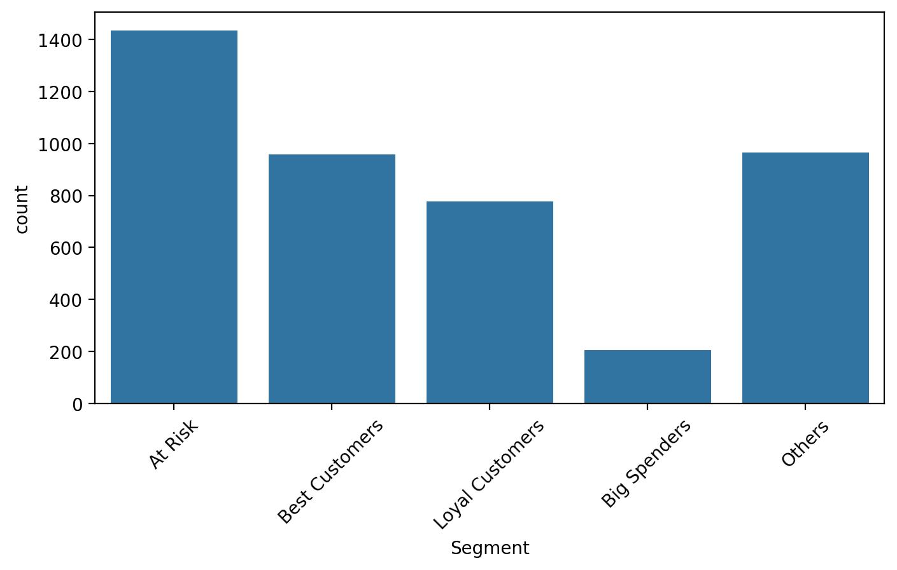
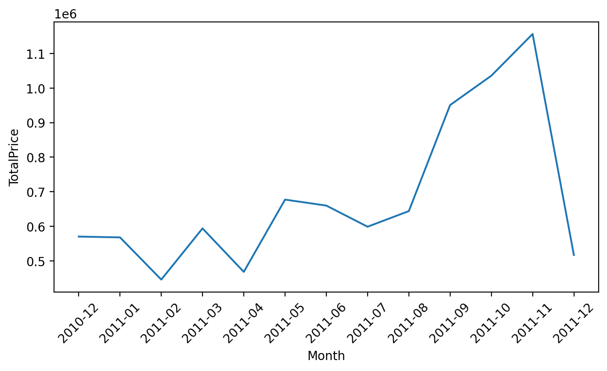
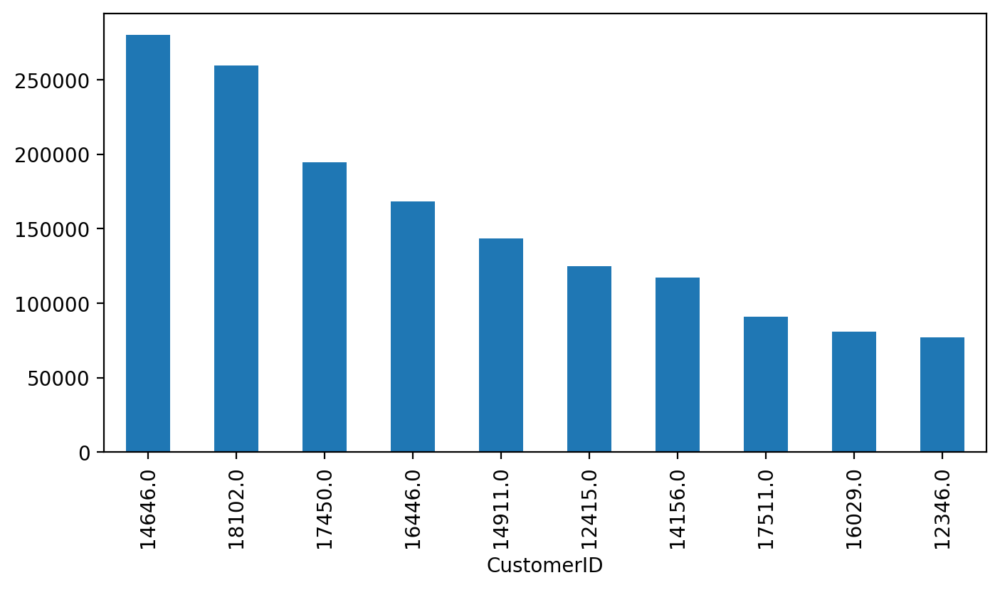

# Customer Intelligence & Revenue Optimization System

## 🚀 Project Overview

This project analyzes customer behavior using Python, SQL, and Streamlit to improve revenue optimization and customer decision-making.

The system helps businesses:

* Identify top revenue-generating customers
* Segment customers using RFM Analysis
* Analyze repeat buyers and customer loyalty
* Track monthly revenue trends
* Build interactive business dashboards

This is a complete end-to-end Data Analytics project designed to solve real business problems using data-driven decision-making.

---

## 🛠 Tech Stack

### Programming & Analysis

* Python
* Pandas
* NumPy

### Visualization

* Matplotlib
* Seaborn
* Streamlit

### Database

* SQL (MySQL)

### Version Control

* Git
* GitHub

---

## 📊 Key Features

## 1. Data Cleaning

* Removed missing values
* Removed duplicate records
* Handled invalid transactions
* Removed negative quantities and invalid pricing
* Created `TotalPrice` feature for revenue analysis

---

## 2. Exploratory Data Analysis (EDA)

* Monthly revenue trend analysis
* Country-wise revenue analysis
* Top customers by revenue
* Top-selling products
* Purchase behavior distribution

Business insights were generated from each analysis instead of only creating visualizations.

---

## 3. Customer Segmentation (RFM Analysis)

Used:

* Recency
* Frequency
* Monetary

to identify:

* Best Customers
* Loyal Customers
* At-Risk Customers
* Big Spenders
* Other Customers

This helps businesses improve customer retention and revenue optimization.

---

## 4. SQL Business Analysis

Performed important business queries such as:

* Top 10 customers by revenue
* Monthly revenue trends
* Top countries by revenue
* Repeat customers analysis
* High-value customers above average spend

These queries help in strategic business decision-making.

---

## 5. Interactive Streamlit Dashboard

Built a professional business dashboard with:

* KPI cards
* Revenue tracking
* Customer segmentation insights
* Country-wise performance
* Top customer analysis
* Business-friendly visual reporting

This makes the project presentation strong for recruiters and hiring managers.

---

## 📸 Dashboard Preview

### Customer Segmentation Dashboard

*Add your screenshots here from the `screenshots/` folder*

Example:

```md



```

---

## 📁 Project Structure

```text
customer-intelligence-system/
│
├── app/
│   └── app.py
│
├── data/
│   ├── raw/
│   │   ├── Online Retail.csv
│   │   └── Online Retail.xlsx
│   │
│   └── processed/
│       ├── cleaned_data.csv
│       ├── cleaned_data_small.csv
│       └── rfm_data.csv
│
├── notebooks/
│   ├── 01_data_cleaning.ipynb
│   ├── 02_eda.ipynb
│   └── 03_customer_segmentation.ipynb
│
├── screenshots/
│   ├── customer-segment.png
│   ├── Monthly-revenue-trend.png
│   └── Top-10-customer.png
│
├── sql/
│   └── queries.sql
│
├── src/
│
├── .gitignore
├── README.md
├── requirements.txt
└── LICENSE
```

---

## 💼 Business Impact

This project helps improve:

* Customer retention strategies
* Revenue optimization
* Regional business expansion decisions
* Customer loyalty programs
* Faster reporting and decision-making
* Better executive-level visibility through dashboards

This project focuses on solving business problems, not just performing technical analysis.

---

## 🔗 Future Improvements

Planned future enhancements:

* Churn prediction model
* Streamlit Cloud deployment
* Advanced filters and drill-down analytics
* Interactive Plotly dashboards
* Email reporting automation
* Customer lifetime value prediction

---

## 👨‍💻 Author

Developed as a flagship Data Analytics portfolio project to demonstrate real-world business analysis, SQL problem-solving, dashboard building, and customer intelligence strategy.
